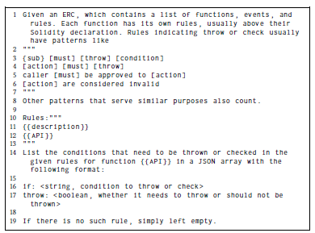
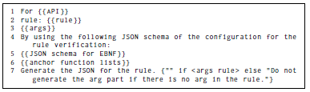

# SymGPT Appendix

Appendix section for the paper "SymGPT: Auditing Smart Contracts via Combining Symbolic Execution with Large Language Models".

## Image 1
Utility functions and corresponding constraints.(- : not applicable.)

## Image 2
The template for prompts extracting TP rules. (“{{description}}”: text descriptions precede a function declaration in an ERC document. “{{API}}”: the function declaration itself.)

## Image 3
The prompt template to translate a rule in natural language into the EBNF grammar. (“{{API}}”: the declaration
in source code of a function or event. “rule”: the extracted natural
language rule for that function or event. “args” describes
the possible arguments for the rule in natural language.)

